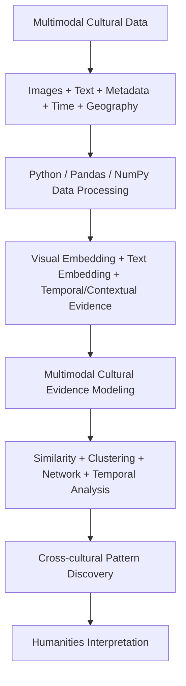

# Multimodal Cultural Evidence Modeling and Computational Analysis

**Cross-cultural Buddhist Object Dataset — Pilot**

This repository is a reproducible computational-humanities pilot for structuring museum records as multimodal cultural evidence and exploring potential cross-cultural patterns. It extends interests in cultural heritage and multimodal human-centered research toward computational cultural analysis.

## Research motivation

Digitized cultural collections make it possible to combine computer vision, NLP, network analysis, and temporal analysis across larger corpora. Computational methods can surface candidate relationships that merit close humanistic reading, but they do not replace historians or prove cultural transmission. This project therefore separates computational observation from possible humanities interpretation.

## Research questions

- **RQ1:** What computable visual and semantic similarities and differences appear across cultural contexts?
- **RQ2:** To what extent are visual similarities aligned with or decoupled from semantic similarities?
- **RQ3:** Can temporal, geographic, and cultural metadata reveal potential cross-regional associations and patterns of cultural evolution?

## Conceptual framework



## Data and licensing

Metadata is collected from [The Metropolitan Museum of Art Collection API](https://metmuseum.org/art/collection). The repository preserves object URLs, source fields, and the museum's `isPublicDomain` flag. Images are downloaded only when an image URL is available and are intended for research and educational demonstration under the source institution's open-access terms. This classification and the Nepal→Himalayan assignment are analytical simplifications for the pilot, not definitive cultural taxonomies. See `docs/dataset_card.md`.

## Methods and pipeline

1. `collect_data.py`: keyword search, object-ID de-duplication, cached metadata, retries, and raw CSV.
2. `clean_data.py`: missingness, URL/image eligibility, context categorization, structured metadata textualization, and pilot selection.
3. `download_images.py`: Pillow-validated local images with error log.
4. `image_embedding.py` and `text_embedding.py`: frozen OpenCLIP and multilingual MiniLM feature extraction.
5. `multimodal_analysis.py`: cosine similarity, PCA/UMAP fallback, cross-modal alignment, and exploratory KMeans.
6. `network_analysis.py` and `temporal_analysis.py`: top-k similarity network, centrality, and century summaries.
7. `app/app.py`: Streamlit Cultural Evidence Explorer.

The multimodal baseline is `concat(0.5 * normalized_visual, 0.5 * normalized_text)`. Weights and random seed 42 are configurable in `src/config.py`. No embedding is synthetic; if a model cannot run, the stage fails clearly rather than fabricating results.

## Quick start

```bash
python3 -m venv .venv
source .venv/bin/activate
pip install -r requirements.txt
PYTHONPATH=. python -m src.collect_data --test
PYTHONPATH=. python -m src.collect_data --max-objects 500
PYTHONPATH=. python -m src.clean_data --max-records 300
PYTHONPATH=. python -m src.download_images
PYTHONPATH=. python -m src.image_embedding
PYTHONPATH=. python -m src.text_embedding
PYTHONPATH=. python -m src.multimodal_analysis
PYTHONPATH=. python -m src.network_analysis
PYTHONPATH=. python -m src.temporal_analysis
PYTHONPATH=. python -m src.reporting
streamlit run app/app.py
```

Model weights are downloaded by the model libraries on first use. CPU is supported; Apple MPS is used when available. Figures and results are generated from the actual run and should not be pre-filled with claims.

## Main outputs

`data/processed/cultural_objects.csv`, embedding `.npy` files with index CSVs, quality reports, top-pair tables, cross-modal cases, clustering evaluation, network tables, temporal summaries, `results/results_summary.md`, and figures including embedding spaces, alignment, clustering, network, and temporal distribution.

### Generated snapshot

The validated local run contains 489 raw records, 300 processed records, 300 images, 44,850 object pairs, 9,529 cross-context pairs, and context counts of Other=265, South_Asia=26, East_Asia=5, Himalayan=4. The imbalance is reported rather than corrected by synthetic balancing. The generated summary is authoritative: `results/run_summary.json`.

## Limitations and ethics

The Met collection is not a complete representation of global cultural heritage. Search terms, institutional collecting history, uneven metadata, missing dates/images, and simplified context labels create selection and measurement bias. Similarity means computational proximity; it should not be interpreted as evidence of direct historical transmission. Candidate bridge objects are not historical intermediaries. Geographic analysis is category-level unless reliable coordinates are available.

## Future work

Wikidata alignment, Europeana and additional museum collections, knowledge-graph construction, geospatial modeling, diachronic analysis, and human-in-the-loop domain-expert validation are planned extensions.

## Author

Research project for doctoral-application portfolio development in computational humanities, building on cultural-heritage and multimodal human-centered research.
