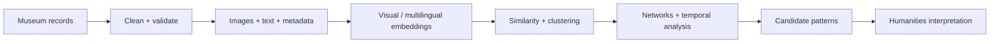
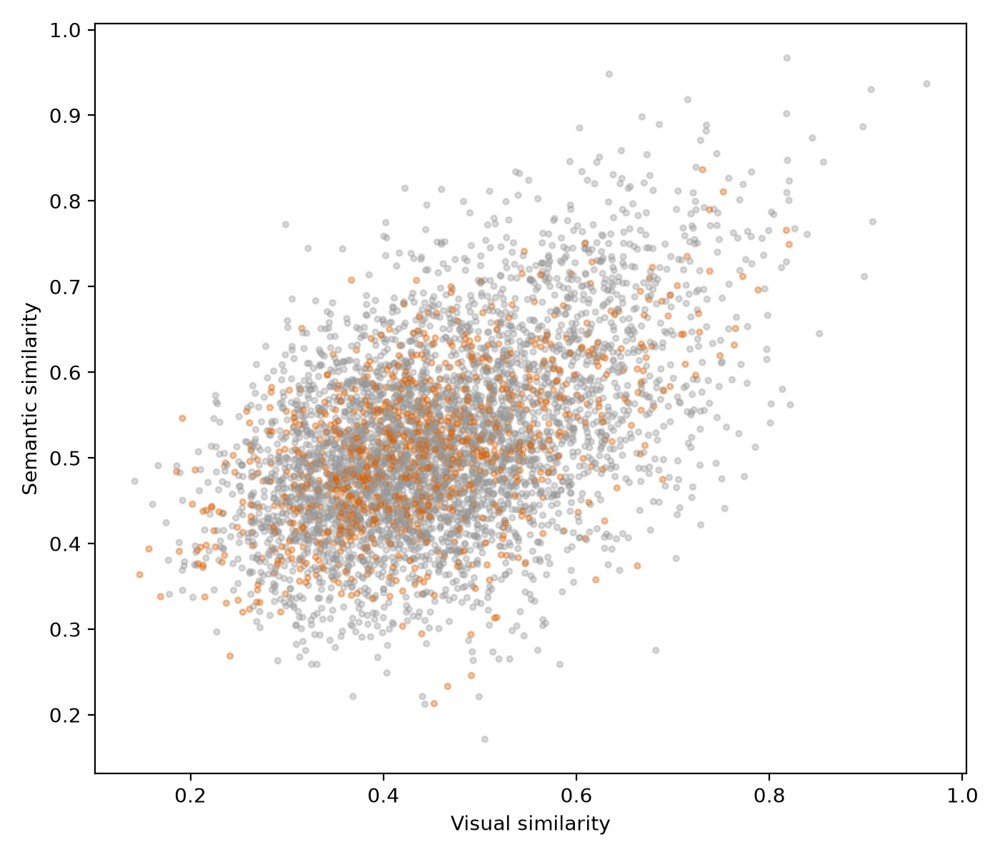

<div align="center">

# Multimodal Cultural Evidence Explorer

### 多模态文化证据建模与计算分析

**A reproducible computational-humanities pilot for discovering visual, semantic, temporal, and contextual patterns across cultural objects.**

[](https://github.com/stella1919/multimodal-cultural-evidence)
[](https://www.python.org/)
[](https://streamlit.io/)
[](LICENSE)

[English](#overview) · [中文](#项目概览) · [Quick Start](#quick-start) · [快速运行](#快速运行)

</div>

---

## Overview

This repository presents a reproducible workflow for turning museum records into **traceable multimodal cultural evidence**. It combines images, structured metadata, dates, geography, cultural descriptors, visual embeddings, multilingual text embeddings, similarity analysis, network analysis, and temporal analysis.

The goal is not to automate historical interpretation. The system surfaces computationally interesting patterns and candidate cases for closer humanistic reading.

### Pilot snapshot

| Objects | Images | Object pairs | Cross-context pairs |
|:---:|:---:|:---:|:---:|
| **300** | **300** | **44,850** | **9,529** |

**Source:** The Metropolitan Museum of Art Collection API · **Focus:** cross-cultural Buddhist object records · **Status:** reproducible research prototype

## Research questions

1. What visual and semantic similarities appear across cultural contexts?
2. When do visual similarity and cultural semantics align—or diverge?
3. Can temporal, geographic, and contextual metadata reveal candidate cross-regional patterns?

## Conceptual pipeline



## 项目概览

本项目将博物馆对象记录中的图像、文本、年代、地域与文化属性组织为**可追溯的多模态文化证据**，并通过视觉表征、多语言文本嵌入、相似度、聚类、网络和时间分析，探索跨文化对象之间可能存在的模式。

计算结果只用于发现值得进一步阅读的候选关系，不等同于历史因果，也不直接证明文化传播。

### 数据快照

- **300** 条处理后的文化对象记录
- **300** 张已验证示例图像
- **44,850** 个对象对
- **9,529** 个跨语境对象对
- 数据来源：The Metropolitan Museum of Art Collection API

## Featured outputs

- [Interactive Streamlit explorer](app/app.py)
- [Cross-modal alignment](figures/cross_modal_alignment.png)
- [Multimodal embedding space](figures/multimodal_embedding_space.png)
- [Similarity network](figures/cultural_similarity_network.png)
- [Generated results summary](results/results_summary.md)
- [Dataset card and limitations](docs/dataset_card.md)



## Quick start

```bash
git clone https://github.com/stella1919/multimodal-cultural-evidence.git
cd multimodal-cultural-evidence

python3 -m venv .venv
source .venv/bin/activate
pip install -r requirements.txt

streamlit run app/app.py
```

The compact image archive is expanded automatically when the app starts. Model weights are downloaded on first use; CPU is supported, and Apple MPS is used when available.

## 快速运行

```bash
git clone https://github.com/stella1919/multimodal-cultural-evidence.git
cd multimodal-cultural-evidence

python3 -m venv .venv
source .venv/bin/activate
pip install -r requirements.txt

streamlit run app/app.py
```

如果浏览器没有自动打开，请访问：

```
http://localhost:8501
```

## Reproducible pipeline

```bash
PYTHONPATH=. python -m src.collect_data --test
PYTHONPATH=. python -m src.collect_data --max-objects 500
PYTHONPATH=. python -m src.clean_data --max-records 300
PYTHONPATH=. python -m src.download_images
PYTHONPATH=. python -m src.image_embedding
PYTHONPATH=. python -m src.text_embedding
PYTHONPATH=. python -m src.multimodal_analysis
PYTHONPATH=. python -m src.network_analysis
PYTHONPATH=. python -m src.temporal_analysis
PYTHONPATH=. python -m src.reporting
```

## Repository map

| Path | Purpose |
|---|---|
| `app/` | Streamlit interactive explorer |
| `src/` | Data collection, cleaning, embeddings, analysis |
| `data/` | Raw and processed metadata, embeddings, compact image archive |
| `results/` | Similarity tables, network outputs, summaries |
| `figures/` | Publication-style exploratory figures |
| `docs/` | Dataset card, methods, and project notes |
| `notebooks/` | Reproducible exploratory notebooks |

## Methods

- **Visual representation:** frozen OpenCLIP features
- **Text representation:** multilingual sentence-transformer embeddings
- **Multimodal baseline:** `0.5 × normalized visual + 0.5 × normalized text`
- **Analysis:** cosine similarity, PCA/UMAP fallback, KMeans, graph centrality, temporal summaries
- **Reproducibility:** fixed random seed, cached metadata, transparent filtering, explicit quality reports

## Data, licensing, and limits

Metadata is collected from [The Metropolitan Museum of Art Collection API](https://metmuseum.org/art/collection). The repository preserves source URLs and the museum's `isPublicDomain` field. Image use follows the source institution's open-access terms for research and educational demonstration.

The Met collection is not a complete representation of global cultural heritage. Search terms, collecting history, missing metadata, and simplified context labels create selection and measurement bias. Similarity means computational proximity—not direct historical transmission.

## Independent research note

This is an independent computational-humanities research project built around cultural heritage, multimodal analysis, and human-centered interpretation.

---

<div align="center">

**Observe patterns · document evidence · interpret carefully**

</div>
